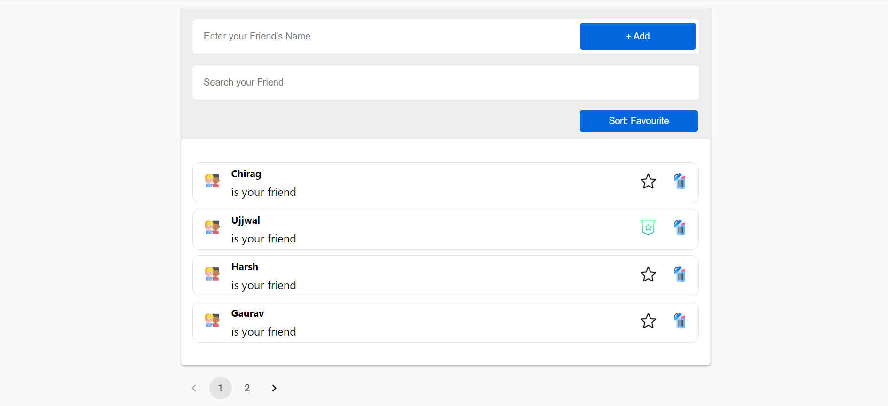

# Friends List

## 🔑 Key Features

- Add new friend in the list on enter.
- Search your friends (Didn't used any external library).
- Mark favourite to some of your friends.
- Sort the list according to marked favourite friends.
- Delete friends from the list. A confirmation box will also pop-up.
- Supports Pagination when there are more than 4 enteries.

## ⭐ How to get started on local system?
1. Drop a ⭐ on the Github Repository.
2. Clone the Repo by going to your local Git Client and pushing in the command:
git clone https://github.com/mechiragjain/friends-list.git
3. Now, push in the command which will install all the dependencies of the project:
npm install
4. Start your development application - npm start 